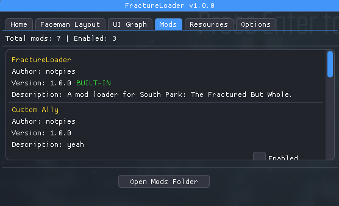
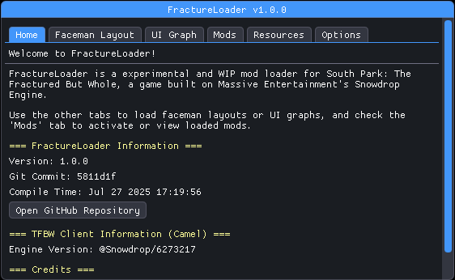

<h1 align="center">FractureLoader</h1>

<p align="center">
  <a href="https://github.com/NOTPIES/FractureLoader/releases">
    
  </a>
</p>

**FractureLoader** is a mod loader for **_South Park: The Fractured But Whole_**.  
It injects into the game at runtime and dynamically loads mods from disk.

<p align="center">   </p>

FractureLoader also includes extra tools for Snowdrop Engine debugging and modding, such as:
- A **UI Blueprint Loader** (muigraph)
- An **Faceman Engine Layouts Loader**
- Platform Changer (enable platform-specific behavior, etc)

> **Note:** This project is **experimental** and under **active development**.

---

### **Supported Versions**
- **Game:** South Park: The Fractured But Whole – **Latest Steam/Ubisoft Connect version** (Steam Build ID 11479433)

---

## Features

- **Modular Loading:** Loads mods from a `Mods/` folder next to the game executable.
- **In-Game Overlay:** Displays mod information and modding utilities directly in the game.
- **Asset Overrides:** Loads and overrides game files from disk without repacking `.sdf` archives.
- **No File Size Restrictions:** Modified files do **not** need to match the original file size.
  
    > **Important:** If you modify binary files like `.mmb`, ensure you also update any size fields (in hex) inside the file as required by the format.

---

## How It Works

FractureLoader replaces or injects as the `uplay_r1_loader64.dll` to gain entry into the game process.  
Once injected, it hooks into **Snowdrop Engine** functions (e.g., file stream loader) to:

- Initialize mods
- Override game assets
- Provide additional debugging utilities

---

## Mod Layout

Each mod resides in its own subfolder under `FractureLoader/Mods/`.

**Example Directory Structure:**
```

SouthPark_TFBW/
├── FractureLoader.dll         (renamed to uplay_r1_loader64.dll)
├── SouthPark_TFBW.exe
└── FractureLoader/
  └── Mods/
    └── ExampleMod/
      ├── manifest.ini
      └── camel/         (override game files)

````

---

### `manifest.ini` Format

```ini
name=ExampleMod
author=notpies
version=1.0.0
description=Example description
````

**Field Explanations:**

* **`name`** – The display name of the mod (shown in the overlay).
* **`author`** – The creator of the mod.
* **`version`** – The mod’s version number for compatibility tracking.
* **`description`** – A short text describing the mod’s purpose or content.
* **`preloadCustomAssets`** – (Optional) Set this to true to enable support for more custom assets (if the custom assets you use on the mod already work without this option, then don't enable this as it may cause some unexpected crashes)

---

## Setup

1. **Inject `FractureLoader.dll` into the game:**

   * **Recommended:** Rename `FractureLoader.dll` to `uplay_r1_loader64.dll`
     and rename the original dll that is on the root game folder to `uplay_r1_loader64_orig.dll`.
   * Place it in the **root game folder** next to `SouthPark_TFBW.exe`.
   * **Alternative:** Use a manual DLL injector to inject `FractureLoader.dll` at runtime.

2. **Launch the game once** to initialize FractureLoader.

3. **Add your mods** to `FractureLoader/Mods/`.

4. **Start the game** as normal. If loaded correctly, the in-game overlay will appear.

---

## Requirements

* **Windows OS**
* **South Park: The Fractured But Whole** (Steam or Ubisoft Connect)
  *Pirated copies are not supported.*

---

## Disclaimer

FractureLoader is **not affiliated** with Ubisoft, Massive Entertainment, or South Park Studios.
It is provided for **offline and educational use only**.
Modding the game may violate its EULA — **use at your own risk**.

---

## Credits

- **[MinHook](https://github.com/TsudaKageyu/minhook)**
- **[ImGui-DirectX-11-Kiero-Hook](https://github.com/rdbo/ImGui-DirectX-11-Kiero-Hook)**
- **[magic_enum](https://github.com/Neargye/magic_enum)**

- **[Universal-Snowdrop-Modloader](https://github.com/patrickmollohan/Universal-Snowdrop-Modloader)**
  Referenced for Snowdrop Engine file loader flags and insights into asset override mechanics.
